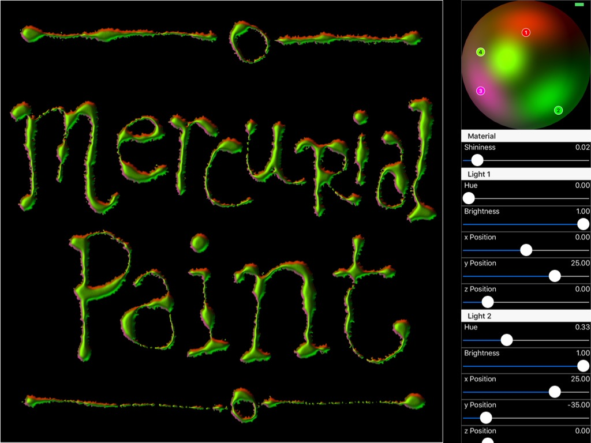

# MercurialPaint
Mercurial Painting using Metal and Core Image

Following on from my recent MercurialText experiment, here's another implementation of `CIHeightFieldFromMask` and `CIShadedMaterial`, MercurialPaint. MercurialPaint is an Apple Pencil driven sketching app that uses Metal and Metal Performance Shaders to create a skeletal or scaffold texture followed by a Core Image step to apply the 3D embossed effect based on an image of a hemisphere created with Scene Kit.

My MercurialText post discusses the Core Image and Scene Kit steps, so this article begins by discussing how I create the scaffold image using Metal.

## Initialising Metal

MercurialPaint is a `UIView` that contains a Metal Kit `MTKView` to display the "in-flight" scaffold image and a standard `UIImageView` for displaying the final image. The technique I use for drawing the pixels borrows from my ParticleLab project: for each touch move, I want to colour in 2,048 pixels randomly positioned around the touch location. To do that, I create a handful of variables that will hold the particle data:

    private var particlesMemory:UnsafeMutablePointer<Void> = nil
    private var particlesVoidPtr: COpaquePointer!
    private var particlesParticlePtr: UnsafeMutablePointer<Int>!
    private var particlesParticleBufferPtr: UnsafeMutableBufferPointer<Int>!

    private var particlesBufferNoCopy: MTLBuffer!

Each particle item will hold a random value that the Metal shader will use as a seed for its own random number generator which will define the particle's position. So, after using the magic `posix_memalign()` function and initialising the pointers and buffers:

    posix_memalign(&particlesMemory, alignment, particlesMemoryByteSize)
    
    particlesVoidPtr = COpaquePointer(particlesMemory)
    particlesParticlePtr = UnsafeMutablePointer<Int>(particlesVoidPtr)
    particlesParticleBufferPtr = UnsafeMutableBufferPointer(start: particlesParticlePtr,
        count: particleCount)

I populate the buffer pointer with random values:

    for index in particlesParticleBufferPtr.startIndex ..< particlesParticleBufferPtr.endIndex
    {
        particlesParticleBufferPtr[index] = Int(arc4random_uniform(9999))

    }

...and create the a new Metal buffer to share the particles between Swift and Metal:

    particlesBufferNoCopy = device.newBufferWithBytesNoCopy(particlesMemory,
        length: Int(particlesMemoryByteSize),
        options: MTLResourceOptions.StorageModeShared,
        deallocator: nil)

## Touch Handling

The Apple Pencil can sample at 240hz and the `touchesMoved` will only ever be invoked at a maximum of 60hz, so MercurialPaint makes use of coalesced touches. To simplify the transfer of the touch data between Swift and Metal, I only support up to four coalesced touches and in `touchesMoved()`, I take a note of the locations of the coalesced touches and the force of the first:

    override func touchesMoved(touches: Set<UITouch>, withEvent event: UIEvent?)
    {
        guard let touch = touches.first,
            coalescedTouches =  event?.coalescedTouchesForTouch(touch) else
        {
            return
        }

        touchForce = touch.type == .Stylus
            ? Float(touch.force / touch.maximumPossibleForce)
            : 0.5
        
        touchLocations = coalescedTouches.map
        {
            return $0.locationInView(self)
        }
    }

When the touches end, I reset the touch locations to (-1, -1):

    touchLocations = [CGPoint](count: 4, 
        repeatedValue: CGPoint(x: -1, y: -1))

To simplify the transfer of data between Swift and Metal, the touch locations are converted to two separate `vector_int4` values - one the the four 'x' co-ordinates and one for the four 'y' co-ordinates. So, inside the Metal view's delegate's `drawInMTKView()`, I create buffers to hold that location data and populate them using a little helper function, `touchLocationsToVector()`:

    var xLocation = touchLocationsToVector(.X)
    let xLocationBuffer = device.newBufferWithBytes(&xLocation,
        length: sizeof(vector_int4),
        options: MTLResourceOptions.CPUCacheModeDefaultCache)

    var yLocation = touchLocationsToVector(.Y)
    let yLocationBuffer = device.newBufferWithBytes(&yLocation,
        length: sizeof(vector_int4),
        options: MTLResourceOptions.CPUCacheModeDefaultCache)

The force of the touch is passed to Metal as a float value. 

## Mercurial Paint Compute Shader

The compute shader to create the scaffold image is pretty basic stuff. Along with the particles list, it's also passed the four 'x' and four 'y' positions and the normalised force of the touch.

We know from above if there's no coalesced touch for one of the items in the position vectors, the value will be -1, so the first job of the shader is to loop over the vectors and exit the function if 'x' or 'y' is -1:

    for (int i = 0; i < 4; i++)
    {
        if (xPosition[i] < 0 || yPosition[i] < 0)
        {
            return;

        }

...then use the value of the 'particle' as a random seed and create a random angle and radius, which is based on the touch force:

    const float randomAngle = rand(randomSeed + i, xPosition[i], yPosition[i]) * 6.283185;
    
    const float randomRadius = rand(randomSeed + i, yPosition[i], xPosition[i]) * (touchForce * 200);

...and, finally, draw a pixel to the texture using those randomly generated values:

    const int writeAtX = xPosition[i] + int(sin(randomAngle) * randomRadius);
    const int writeAtY = yPosition[i] + int(cos(randomAngle) * randomRadius);
    
    outTexture.write(float4(1, 1, 1, 1), uint2(writeAtX, writeAtY));

## Metaball Effect with Metal Performance Shaders

Much like my Globular project, I use a Gaussian blur and threshold to convert the individual pixels drawn by the shader into a more liquid type image. Because I'm using Metal, rather than using Core Image, I use Metal Performance Shaders. These are lazily created:

    lazy var blur: MPSImageGaussianBlur =
    {
        [unowned self] in
        
        return MPSImageGaussianBlur(device: self.device,
            sigma: 3)
        }()
    
    lazy var threshold: MPSImageThresholdBinary =
    {
        [unowned self] in
        
        return MPSImageThresholdBinary(device: self.device,
            thresholdValue: 0.5,
            maximumValue: 1,
            linearGrayColorTransform: nil)

    }()

..and once the compute shader has finished, the two filters are applied to the output texture and end up targeting the Metal Kit view's drawable's texture:

    blur.encodeToCommandBuffer(commandBuffer,
        sourceTexture: paintingTexture,
        destinationTexture: intermediateTexture)
    
    threshold.encodeToCommandBuffer(commandBuffer,
        sourceTexture: intermediateTexture,
        destinationTexture: drawable.texture)

## Core Image Embossing Step

As I mentioned above, for the full description of the embossing step, see my MercurialText post. In MercurialPaint, I wait for the touches end to apply these filters. The only real differences are that I create a CIImage from the Metal Kit view's drawable's texture:

    let mercurialImage = CIImage(MTLTexture: drawable.texture, options: nil)

I've also added an additional Core Image filter, CIMaskToAlpha to use as the source image to the height map filter.

## Conclusion

This could be one of my favourite experimental projects so far: it mashes up Scene Kit, Core Image, Metal and Metal Performance Shaders and it uses force data! Hopefully, it's another example of not only the ludicrous power of the iPad Pro, Metal and Core Image but the creative potential of what can be achieved by combining Apple's range of different frameworks. 

This project isn't a final product and, as such, is sprinkled with magic numbers. 

As always, the source code for this project is available at my GitHub repository here. 
